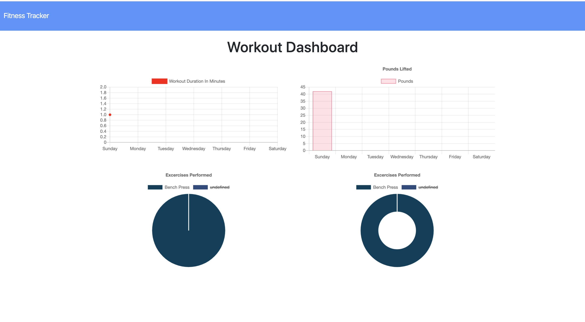

# Workout-Tracker

A Mongo database with a Mongoose schema that handles routes with Express.
This app allows you to log exercises and workouts and track your efforts.

## Getting Started

The user lands on the home page and has the option to cotinue a workout and another exercise or start a new workout. The option to click on the dashboard to view stats is also there.

## Technologies:

* JavaScript
* Node.JS
* Express.JS
* MongoDB
* Mongoose.JS

